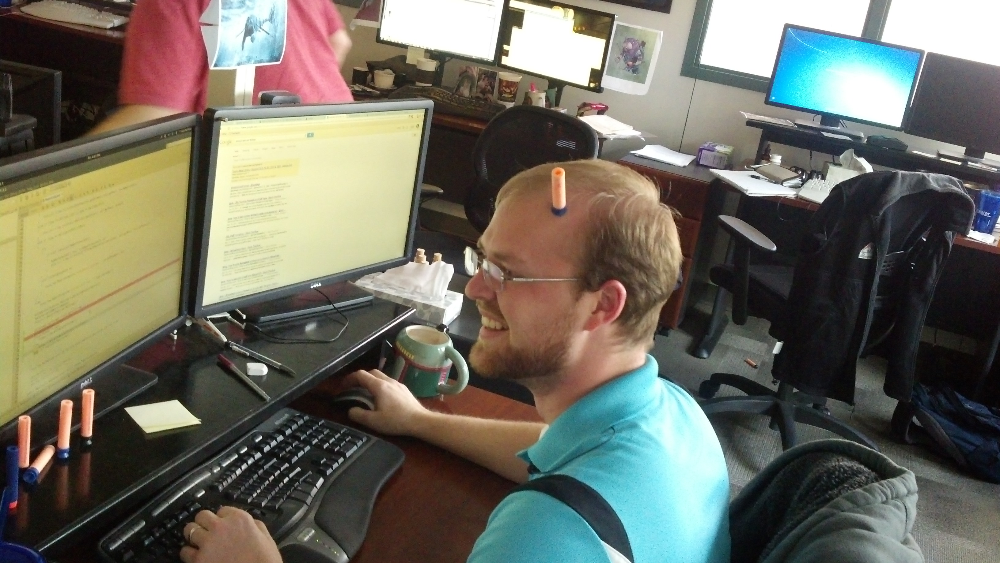

<!-- .slide: data-background="./images/background.jpg" -->
## presentation template
#### Robert Whiting

note:
Here are some speaker notes. Hit 's' to get the awesome sauce!

---

## the problem

----

making presentations takes time

<!-- .element height="500px" .element style="border: 0; background: None; box-shadow: None" -->

----

- people like beautiful things
- markdown is amazing
- use it

---

## the solution

- RevealJs
- RevealMd

---

## in summary

----

> stop being dumb

----

> be awesome instead

---

# #ShipIt
